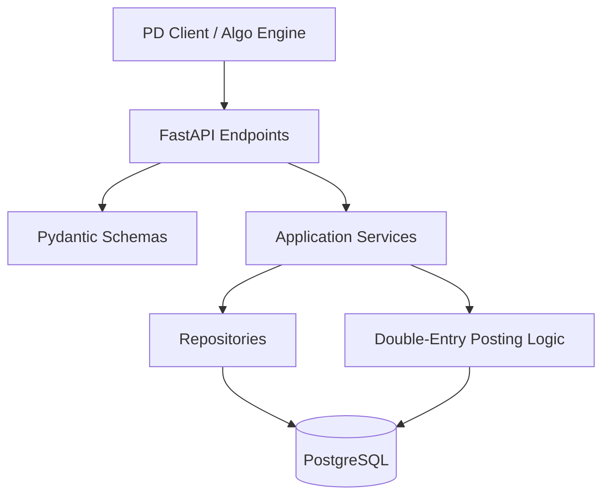
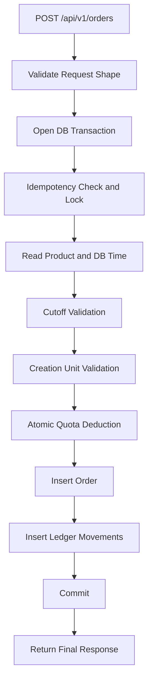

# System Architecture

## High-Level Architecture

The system uses a synchronous API backed by PostgreSQL transactional guarantees.



## Request Path

### Submit Order



### Cancel Order

```mermaid
flowchart TD
    A[POST /api/v1/orders/{clientOrderId}/cancel] --> B[Open DB Transaction]
    B --> C[Lock Order Row]
    C --> D[Validate State Transition]
    D --> E[Release Quota Once]
    E --> F[Insert Reversal Ledger Movement]
    F --> G[Commit]
    G --> H[Return Final Order State]
```

## Core Architectural Decisions

## 1. Direct Transactional Flow
The system does not use a message queue for the core order path.

Reason:
- the assignment requires immediate final outcome behavior
- correctness depends on short, auditable DB transactions
- concurrency control is simpler and easier to explain with PostgreSQL row locking and conditional updates

## 2. PostgreSQL Is the Source of Truth
All critical guarantees are enforced at or around the database layer:
- idempotency
- quota consumption
- cancellation release semantics
- order state transitions
- ledger integrity
- authoritative cutoff time

## 3. Swagger-First API Design
Swagger should be visible before logic is complete.

Reason:
- it makes the contract reviewable early
- it helps lock response shapes before DB work expands
- it supports incremental implementation endpoint by endpoint

## 4. One Endpoints File
All endpoints are intentionally placed in one file.

Reason:
- easier review during assignment
- smaller API surface
- clear route visibility in one place

The one-file rule applies only to the endpoint layer, not to services or repositories.

## 5. Single-Purpose Internal Modules
Each non-endpoint file should serve one purpose only.

Examples:
- quota DB logic belongs in `quota_repository.py`
- cutoff rule evaluation belongs in `cutoff_service.py`
- ledger posting belongs in `ledger_service.py`

## Data Ownership Model

### Orders
- holds final order state and response fields
- supports read-back by `client_order_id`

### Idempotency Store
- tracks first accepted request identity
- stores replayable outcome or payload fingerprint

### Quota Store
- tracks daily quota availability and usage per product
- supports exact-once reserve and release

### Ledger Store
- records debit/credit entries for cash movements
- supports executable zero-sum checks by currency

## Time Authority

The authoritative time is PostgreSQL server time.

Policy:
- cutoff is evaluated using DB time in the product market timezone
- client clock is never used for acceptance decisions
- if the request reaches the DB after cutoff, it is late

## Concurrency Model

### Submission
Use a short database transaction with:
- idempotency row lock or unique guard
- product/quota row lock or atomic conditional update
- insert of order and ledger rows in the same transaction

### Cancellation
Use a short database transaction with:
- order row lock
- exact-once quota release guard
- reversal ledger insertion

## Error Model

The API should standardize deterministic business errors such as:
- `ERR_QUOTA_EXCEEDED`
- `ERR_CUTOFF_PASSED`
- `ERR_INVALID_UNITS`
- `ERR_ORDER_NOT_FOUND`
- `ERR_INVALID_ORDER_STATE`
- `ERR_IDEMPOTENCY_CONFLICT`

## Non-Goals for First Delivery

- no message queue for order ingestion
- no frontend ops blotter
- no distributed locking layer
- no cross-region deployment design
- no advanced auth unless assignment later requires it
